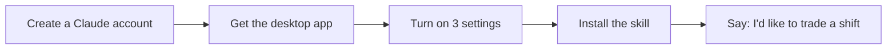

# Setting up Claude

**Version:** 0.01.08

This guide gets you from no Claude account to ready for the CinciPEM ShiftMate skill. It takes about 10 minutes. When you're done, go back to the [README](README.md) to install the skill.

## 1. Create a Claude account

1. Go to **[claude.ai](https://claude.ai)**.
2. Sign up with your email address or a Google account.
   <!-- SCREENSHOT: claude.ai sign-up page -->
3. If you used email, open the message Claude sends you and click the link to confirm.
4. Answer the few welcome questions (your name, what you'll use Claude for).

The free plan should work for this skill (we're still confirming the website settings below on free accounts). Paid plans give you more use per day; see **[Claude's plans](https://claude.com/pricing)**.

## 2. Get the app

**You need the Claude desktop app** for Windows or Mac: **[download it here](https://claude.com/download)**, install it, and sign in. ShiftMate 0.01.08 keeps your settings in an encrypted folder on your computer through a desktop extension, so it works only in the desktop app, not in a web browser.

The phone app ([iPhone](https://apps.apple.com/us/app/claude-by-anthropic/id6473753684), [Android](https://play.google.com/store/apps/details?id=com.anthropic.claude)) can't run ShiftMate 0.01.08, because it can't reach the extension on your computer. Phone use is planned for a later version. Do the setup below on a computer.

## 3. Turn on three settings

Open **Settings** (click your name or initials in the bottom-left corner), then:

1. **Code execution** (Settings → **Capabilities**): turn on **Code execution and file creation**. The skill can't run without it.
   <!-- SCREENSHOT: Capabilities > Code execution and file creation -->
2. **Allowed websites** (same page, under code execution): turn on network access if it's off, then under **Additional allowed domains** add:
   - `www.shiftadmin.com` (so the skill can read the schedule)
   - `raw.githubusercontent.com` (so the skill can update itself)
   - `api.github.com` (so the skill can send your feedback)
   <!-- SCREENSHOT: Additional allowed domains with all three entries -->
   If you'd rather not, the skill still works: you'll attach the schedule file yourself each time, install updates by hand, and email your feedback. During setup, the skill checks that it can reach all three and offers to walk you through adding any that are missing.
3. **Memory**: make sure **Generate memory from chat history** is on. It's on by default for most accounts. With memory on, you enter the skill passphrase once. Memory keeps only your passphrase and where your Local Data folder is; your settings, preferences and blocked dates are kept, encrypted, in that folder on your computer.
   <!-- SCREENSHOT: Memory setting -->

Later, Claude may ask for a few other permissions, such as opening a file you attach or saving an update. The user guide explains each one: see [Claude may ask for permission](USERGUIDE_0.01.08.md#claude-may-ask-for-permission). Claude never asks for your ShiftAdmin username or password.

## 4. Install the skill

Go back to the **[README](README.md#install-the-skill)** and follow the install steps.
